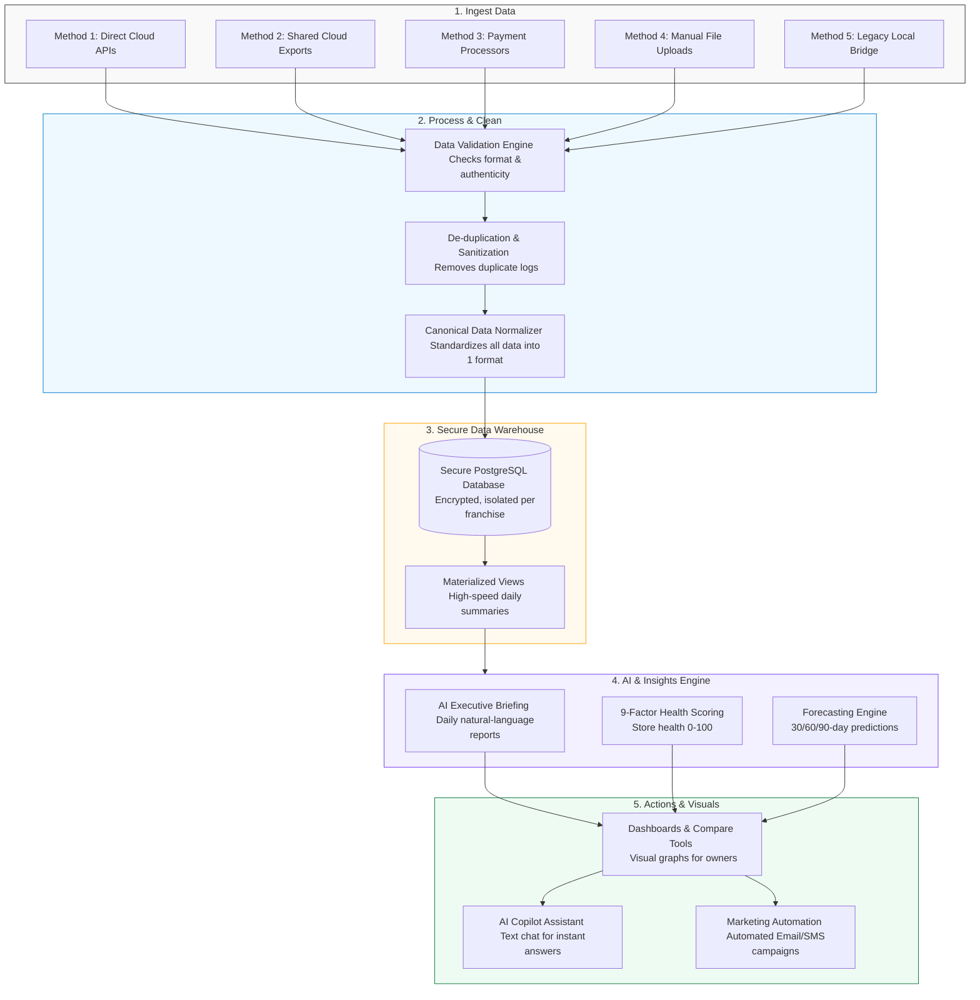

# F3: AI-Powered Fintech for Franchises Intelligence Platform
## Executive Project Summary & Delivery Blueprint

**Prepared For:** Franchise Brand Stakeholders & Client Review  
**Date:** June 12, 2026  
**Status:** Ready for Client Sign-off  
**Purpose:** This document details the system design, implementation phases, integration methods, software modules, and third-party dependencies of the F3: Fintech for Franchises Intelligence Platform.

---

## 1. Executive Summary: The Intelligence Layer

The **F3: Fintech for Franchises Intelligence Platform** is a custom software-as-a-service (SaaS) solution designed to serve as a single, unified brain for multi-location franchise operations. 

Modern franchises typically have data scattered across multiple points: point-of-sale (POS) systems, payment gateways, customer loyalty databases, and email/SMS marketing channels. This fragmentation makes it difficult to see network-wide trends.

**Our platform does NOT replace existing software.** It connects to them, automatically grabs the data, normalizes it, and uses advanced Artificial Intelligence (AI) to answer critical growth questions:
* *Why are sales dropping at specific locations?*
* *Which stores are underperforming relative to their peers?*
* *Which customers are at risk of leaving, and how can we win them back automatically?*
* *Where should the franchise expand next based on revenue opportunities?*
* *Which stores need immediate operational intervention before issues worsen?*

---

## 2. Five Ways to Integrate Data (All Possible Solutions)

A key challenge for franchises is that different stores may use different technologies. To solve this, our platform supports **5 distinct integration methods**, ensuring every location can be onboarded easily:

| Method | Solution Name | Target Systems | How It Works | Automation Level |
| :--- | :--- | :--- | :--- | :--- |
| **1** | **Direct Cloud API Integration (Real-Time)** | Clover POS, Square, Toast | The platform connects directly to the POS cloud service using secure tokens. Real-time changes (sales, refunds) sync automatically within 60 seconds. | **100% Automated** |
| **2** | **Automated Cloud Storage Sync (Batch)** | Middleware, legacy back-offices | The POS system or franchisee exports daily reports (CSV/Excel) to a secure shared folder (SFTP, AWS S3 or Google Drive). Our engine automatically scans, reads, and processes these files daily. | **Fully Scheduled** |
| **3** | **Merchant Portal API Integration** | Payment gateways (e.g., iAccess, TSYS, Fiserv) | The platform connects to payment processor portals to pull settlement timelines, funding histories, processing fees, and chargeback disputes. | **Daily Automated Sync** |
| **4** | **Intelligent Manual Upload Wizard** | Proprietary or offline POS systems | For stores without internet-enabled POS systems, managers export spreadsheets from their cash registers and upload them via our secure dashboard web page. Our wizard automatically maps column headers and validates data. | **Manual (Self-Service)** |
| **5** | **Legacy On-Premise Database Bridge** | Legacy systems (e.g., NCR Aloha, Micros) | A lightweight, secure sync application is installed locally on the store's back-office server. It extracts transactional logs at closed business hours and pushes them securely to the cloud. | **Automated (Scheduled)** |

---

## 3. The Core Project Flow (From Raw Data to Growth Actions)

Below is the visual step-by-step pipeline showing how raw numbers are transformed into automated marketing actions and executive decisions:

### Detailed Execution Steps:
1. **Fetch & Upload:** Data enters the platform securely via one of the 5 options.
2. **Validate & Cleanse:** The integration engine strips out potential bad data or corrupted rows.
3. **Normalize:** Various store POS data models are translated into our single, standard schema (e.g., standardizing currencies, taxes, and customer formats).
4. **Warehouse:** Structured, PCI-compliant records (which store absolutely **no raw credit card numbers** to ensure security) are saved in Postgres.
5. **AI Compute:** Algorithms calculate performance scores, predict next-month revenue, and construct natural language briefings.
6. **Delivery:** The Franchisor or Franchisee views visual charts, interacts with the AI chatbot, or launches smart marketing campaigns.

---

## 4. Platform Modules in Detail

The system is split into **10 core functional modules**, each representing a dedicated set of features and tools:

### Module 1: Secure Authentication & Role Access
* **Description:** Protects system access. Restricts access based on user hierarchy.
* **Key Features:** Google & Microsoft single sign-on (SSO), email/password login, mandatory Multi-Factor Authentication (MFA via authenticator apps), and security row-level isolation (Franchisees can only see their own store data, while the Franchisor sees everything).

### Module 2: Data Integration Hub
* **Description:** A settings panel where users connect systems and monitor sync progress.
* **Key Features:** Clover/Square connection wizard, automated daily sync queue scheduler, manual CSV file drag-and-drop uploader with progress meters, and detailed sync success/failure logs.

### Module 3: Executive Analytics Dashboard (Franchisor)
* **Description:** A birds-eye dashboard for the corporate brand owner.
* **Key Features:** Total network revenue graphs, geographic mapping of stores, ranked performance tables (best-to-worst locations), store-to-store comparison widgets, and system-wide royalty trackers.

### Module 4: Location Analytics Dashboard (Franchisee)
* **Description:** A tailored dashboard focused on optimizing a single store location.
* **Key Features:** Daily sales counters, transaction history grids, local refund tracking, hourly customer traffic trends, and local marketing success rates.

### Module 5: AI Executive Briefing & Anomaly Engine
* **Description:** The core AI generator that builds natural-language business briefings.
* **Key Features:** Automatic 7 AM daily email briefs (summarizing network progress), automated anomaly alerts (e.g., alert if refund rates spike past 5% at any store), and quick summary cards.

### Module 6: AI Predictive Forecasting Engine
* **Description:** Mathematical projections predicting future growth and cash flow.
* **Key Features:** 30/60/90-day revenue and royalty projections, visual graphs displaying conservative/expected/aggressive forecast corridors, and location growth potential scores.

### Module 7: AI Copilot Assistant
* **Description:** A conversational side-panel assistant similar to ChatGPT, trained on the franchise's actual transaction data.
* **Key Features:** Answers questions like *"Why are sales down in Houston?"*, suggests marketing campaigns based on local trends, and provides immediate data summaries on demand.

### Module 8: Customer Lifecycle & Identity Layer
* **Description:** Tracks customer behaviors without storing sensitive credit card details.
* **Key Features:** Automatic RFM (Recency, Frequency, Monetary) sorting, placing customers in segments (e.g., *New*, *Loyal*, *VIP*, *At Risk*, *Dormant*), and calculating individual Customer Health Scores.

### Module 9: AI Marketing Campaign & Automation Builder
* **Description:** The marketing machine that drives repeat sales.
* **Key Features:** Drag-and-drop Email & SMS compose screens, AI-generated subject lines and ad copy, automated trigger rules (e.g., *“Send a 10% coupon if a VIP customer hasn’t visited in 21 days”*), and conversion tracking.

### Module 10: Admin Operations Center
* **Description:** The technical command center.
* **Key Features:** System health monitors, billing management, active user counts, API usage tracking, and queue controllers (re-trying failed integrations).

---

## 5. API Breakdown: Free vs. Paid Services

To run this platform, we leverage best-in-class third-party APIs. We have carefully organized them into **Paid** (usage-based or monthly subscriptions) and **Free/Included** categories:

### A. Paid APIs (Operation Costs)
These services incur ongoing costs based on volume, usage, or subscription tiers:

1. **Anthropic Claude API (Primary AI Engine):**
   * *Purpose:* Drives the AI Copilot chat, generates daily executive briefings, and analyzes text queries.
   * *Pricing Model:* Usage-based, billed per million text characters processed (tokens). Highly cost-effective compared to custom-built AI models.
2. **OpenAI API (Fallback AI Engine):**
   * *Purpose:* Acts as a secondary backup AI if Claude faces service downtime or rate limits.
   * *Pricing Model:* Usage-based, billed per million characters. Only incurs costs if the primary AI fails.
3. **SendGrid API (Email Engine):**
   * *Purpose:* Sends automated transactional notifications, daily briefings, and bulk marketing emails.
   * *Pricing Model:* Freemium up to 100 emails per day. Paid plans scale from ~$20/month depending on total monthly email volume.
4. **Twilio API (SMS Engine):**
   * *Purpose:* Delivers time-sensitive SMS marketing campaigns and authentication codes (MFA) to user phones.
   * *Pricing Model:* Billed per sent SMS message (usually a fraction of a cent per message).
5. **AWS Hosting Infrastructure (Database & Servers):**
   * *Purpose:* Hosts databases, schedules cron jobs, runs queues, and stores manual file uploads.
   * *Pricing Model:* Monthly server costs based on data storage size and computing power. Scales as the business expands.

### B. Free & Included APIs (No Additional Costs)
These services do not incur direct costs for API usage, as they are bundled with existing merchant accounts or are open-source:

1. **Clover POS Cloud API:**
   * *Purpose:* Accesses live POS sales, inventory, and transaction reports.
   * *Pricing Model:* Free sandbox/development access. Production access is included with the franchise owner's existing Clover merchant account.
2. **Square & Toast POS APIs:**
   * *Purpose:* Integrates with other common POS systems.
   * *Pricing Model:* Development is free. Customer integration is included in the franchisee's existing SaaS subscriptions with Square/Toast.
3. **Payment Processor Gateway APIs (e.g., iAccess):**
   * *Purpose:* Resolves settlement sheets, funding deposits, and chargebacks.
   * *Pricing Model:* Standard reporting APIs provided free of charge by merchant processors to their business account holders.
4. **Google & Microsoft OAuth Services:**
   * *Purpose:* Enables "Sign in with Google" or "Sign in with Microsoft" options.
   * *Pricing Model:* Free SSO authentication APIs provided by Google Cloud and Azure AD.

---

## 6. List of Deliverables & Weekly Milestones

The project will be built and delivered over a **5-week timeline**, with concrete milestones at the end of each week for client review and sign-off:

### Week 1 Deliverable: System Foundation & Visual Design
* **Visual Prototype:** High-fidelity Figma design layouts showing all screen designs (Dashboards, Copilot, Campaign screen, Login portals).
* **System Scaffolding:** Fully configured database, server hosting structure, and automated deployment pipelines.
* **Authentication Portal:** Working user login portal with secure password encryption, Google/Microsoft SSO, and Multi-Factor Authentication (MFA).
* **Role-Based Isolation:** Verified data permission controls ensuring a franchisee can never view unauthorized network data.

### Week 2 Deliverable: Live Integration Engine
* **Clover Cloud Connection:** Working OAuth integration allowing a user to click "Connect Clover", log in, and securely sync store data.
* **Processor Sync:** Working background job that fetches daily funding, fees, and chargeback disputes.
* **Manual Data Upload Wizard:** Working web uploader that lets users drag-and-drop POS spreadsheets, automatically correcting formats.
* **Sync Management UI:** Settings panel displaying connection health, last sync times, and errors.

### Week 3 Deliverable: Dynamic Analytics & Dashboards
* **Franchisor Overview Panel:** Full dashboard displaying system-wide analytics, store performance rankings, and geo-maps.
* **Franchisee Store Panel:** Local dashboard showing individual sales, returns, and local trends.
* **Franchise Health Score (FHS™):** Working calculation engine displaying a score of 0–100 for each store based on growth, retention, and stability factors.
* **Report Exporter:** Working button to download CSV spreadsheet summaries and receive professional PDF briefs via email.

### Week 4 Deliverable: AI Insights & Copilot Launch
* **7 AM AI Executive Briefing:** Scheduled engine compiling network sales into a clear, natural-language email newsletter.
* **Revenue Forecasting Engine:** Predictive algorithms showing future sales curves with conservative vs. aggressive expectations.
* **AI Copilot Side-Panel:** Functional streaming chat interface where users can ask business questions and get real-time data analysis.
* **Anomaly Detector:** Server routines that monitor and alert on immediate issues (like sudden refund spikes).

### Week 5 Deliverable: Marketing Automations & Live Production Launch
* **Campaign Builder Wizard:** Screen to compose custom email and SMS campaigns, with AI assisting in writing text copy.
* **Behavioral Marketing System:** Automation rules that automatically send discounts to churn-risk customers or rewards to VIPs.
* **Admin Command Center:** System dashboard displaying server health, queue processes, and billing meters.
* **AWS Production Deploy:** Launch of the fully optimized, production-ready system on permanent AWS servers with active SSL security certificates.

---

## 7. Client Review & Next Steps

This blueprint outlines a robust, AI-first SaaS framework built on secure, scalable, and cost-efficient components.

To move forward with development:
1. **Confirm the Scope:** Review the modules list and weekly deliverables.
2. **Select Priority Integrations:** Ensure Clover POS sandbox access is requested on Day 1.
3. **Approve Third-Party APIs:** Verify the selection of SendGrid, Twilio, and Anthropic for operations.

*For questions, scope modifications, or to issue formal project kickoff approval, please contact the Platform Engineering & Architecture Team.*
